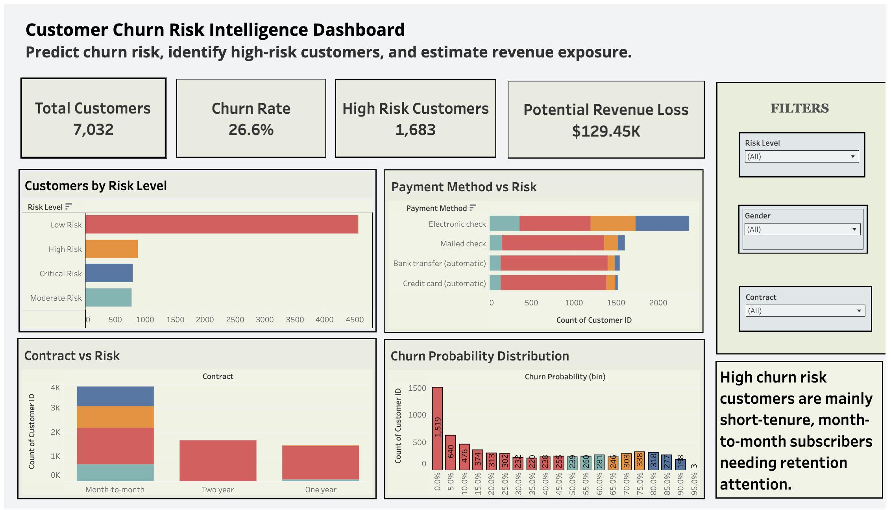

# Predictive Analytics: Building a Customer Churn Prediction Model

An end to end machine learning project to proactively identify customers at risk of churning, using Python, Pandas, and a recall optimized Random Forest model.

## 📊 Interactive Dashboard Preview

🔗 [View the full interactive dashboard on Tableau Public](https://public.tableau.com/views/CustomerChurnPredictionRiskAnalyticsDashboard/CustomerChurnRiskIntelligenceDashboard?:language=en-GB&:sid=&:redirect=auth&:display_count=n&:origin=viz_share_link)

---

## 🚨 Business Problem

Customer churn is one of the most expensive challenges faced by telecommunications companies. Acquiring a new customer typically costs far more than retaining an existing one, making churn prevention a critical business priority.

The objective of this project is to leverage machine learning to identify customers who are most likely to cancel their service, enabling the business to intervene before the customer leaves.

🎯 **Core Business Question**

> Can we build a predictive model that accurately identifies customers with a high likelihood of churn so that the company can take proactive retention actions?

---

## ✅ Solution Overview & Key Results

This project implements an end-to-end machine learning workflow that includes data preprocessing, exploratory data analysis, model training, and automated hyperparameter tuning.

A **Random Forest Classifier** was developed and optimized using `GridSearchCV`, with a primary focus on **maximizing recall for churn predictions**. This ensures the model identifies as many at-risk customers as possible, which is essential for effective retention strategies.

### 📊 Model Performance (Unseen Test Data)

| Metric | Score | Business Interpretation |
|------|------|------|
| **Recall (Churn)** | **72%** | Detects the majority of customers who are likely to churn |
| **Overall Accuracy** | **79%** | Correctly predicts nearly 8 out of 10 customer outcomes |
| **Precision (Churn)** | **55%** | Acceptable trade-off to increase churn detection |

Optimizing for recall ensures that most potential churn cases are flagged early, even if it results in some false positives.

---

## 💡 Business Applications & Strategic Insights

The predictive model allows organizations to move from **reactive churn management to proactive retention strategies**.

### 🎯 Risk-Based Customer Segmentation

Customers can be segmented based on predicted churn probability to prioritize retention efforts.

- **Critical Risk (≥ 80%)**  
  Immediate intervention such as direct outreach or retention specialist support.

- **High Risk (65–80%)**  
  Targeted retention campaigns such as personalized offers or service upgrades.

- **Moderate Risk (50–65%)**  
  Inclusion in loyalty programs and continued engagement monitoring.

---

### 📊 Retention Monitoring Dashboard

Model predictions are exported to CSV and integrated into a **Tableau dashboard** that acts as a daily operational watchlist for the retention team.

The dashboard enables teams to:

- Identify high-risk customers quickly  
- Prioritize outreach efforts based on churn probability  
- Monitor churn patterns across customer segments

---

### 🔎 Identifying Drivers of Churn

Exploratory data analysis revealed several behavioral patterns associated with churn.

Examples include:

- Customers with **month-to-month contracts** show significantly higher churn risk.
- Lower tenure customers tend to churn more frequently.
- Specific service combinations contribute to increased churn probability.

These insights can inform **pricing strategies, contract structures, and product improvements** aimed at reducing long-term churn.

---

## 🔄 Project Workflow

### 1️⃣ Exploratory Data Analysis
Initial analysis uncovered key patterns related to churn, such as contract types and tenure differences between churned and retained customers.

### 2️⃣ Data Preprocessing
A reusable preprocessing pipeline was built using `ColumnTransformer`:

- `StandardScaler` for numerical features  
- `OneHotEncoder` for categorical variables  
- Designed to prevent data leakage and ensure reproducibility

### 3️⃣ Model Training & Optimization

- Model: `RandomForestClassifier`
- Hyperparameter tuning performed with `GridSearchCV`
- Optimization metric: **Recall**

### 4️⃣ Model Evaluation

The final model was evaluated on **unseen test data** to ensure reliable performance.

### 5️⃣ Business Deployment

Prediction outputs were exported and used to build a **Tableau dashboard** for business monitoring and decision making.

---

## 🛠️ Technology Stack

| Category | Tools & Technologies |
|------|------|
| Programming Language | Python |
| Data Analysis | Pandas |
| Machine Learning | Scikit-learn |
| Visualization | Matplotlib, Seaborn |
| Development Environment | Jupyter Notebook / Google Colab |
| Dashboard | Tableau Public |

---

## 📊 Interactive Dashboard

Explore the full dashboard, segment risk levels, and customer insights:

🔗 [**Customer Churn Intelligence Dashboard** on Tableau Public](https://public.tableau.com/views/CustomerChurnPredictionRiskAnalyticsDashboard/CustomerChurnRiskIntelligenceDashboard?:language=en-GB&:sid=&:redirect=auth&:display_count=n&:origin=viz_share_link)

---

## 📁 Repository Contents

| Path | Description |
|------|-------------|
| [`data/WA_Fn-UseC_-Telco-Customer-Churn.csv`](data/WA_Fn-UseC_-Telco-Customer-Churn.csv) | Main dataset of telco customer profiles and churn labels. |
| [`notebooks/churn_analysis_and_modeling.ipynb`](notebooks/churn_analysis_and_modeling.ipynb) | Main Jupyter Notebook containing full workflow: EDA, preprocessing, modeling, and evaluation. |
| [`notebooks/churn_analysis_and_modeling.py`](notebooks/churn_analysis_and_modeling.py) | Python script version of the notebook for automation or reuse. |
| [`results/churn_risk_analysis_recall_optimized.csv`](results/churn_risk_analysis_recall_optimized.csv) | Final churn predictions with probabilities and labels for the full customer base. |

